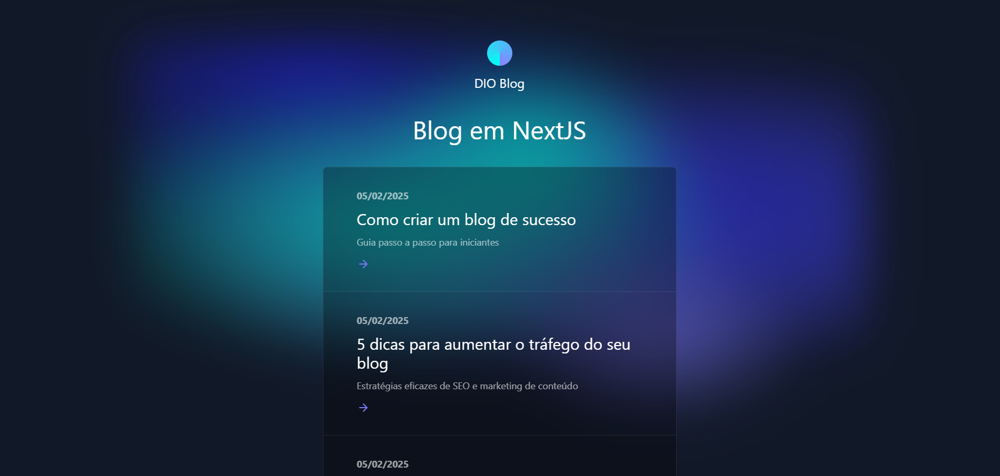

# Blog Pessoal com Next.js

## 📃Descrição

Este projeto é um Blog Pessoal, desenvolvido com Next.js (framework React) e Supabase. Seu objetivo principal é replicar e aprender a como deixar o blog dinâmico e como integrá-lo com um serviço de nuvem.

## 🚀 Tecnologias Utilizadas

- **React.js**: Biblioteca JavaScript para construção de interfaces de usuário.
- **Next.js**: Framework React para renderização do lado do servidor (SSR) e otimizações de SEO.
- **HTML, CSS**: Linguagens padrão para estrutura e estilização de páginas web.
- **JavaScript**: Linguagem de programação para lógica e interação com o DOM.
- **Tailwind CSS**: Framework de design baseado em utilitários que permite aplicar classes CSS diretamente nos elementos HTML.
- **Supabase**: Plataforma de desenvolvimento open source que fornece uma alternativa escalável e de fácil integração para soluções de backend, incluindo banco de dados PostgreSQL, autenticação, armazenamento de arquivos e funções de borda.

## 🚧 Pré-requisitos

- **Node.js e npm (ou yarn)**: Certifique-se de ter o Node.js e o gerenciador de pacotes npm (ou yarn) instalados em seu sistema.
- **Um editor de código**: Visual Studio Code, Sublime Text, Atom, etc.

## 📥 Instalação

1. Clone o repositório: `git clone https://github.com/Nickcarv18/trilha-react-desafio-5`
2. Acesse a pasta do projeto: `cd trilha-react-desafio-5`
3. Instale as dependências: `npm install` ou `yarn install`

### Configuração do Supabase

1. Crie um projeto no Supabase:
   - Acesse o [Supabase](https://supabase.com/) e crie uma conta (ou faça login se já tiver uma).
   - Crie um novo projeto e obtenha as URLs e chaves de API.

2. Configure as variáveis de ambiente:
   - Renomeie o arquivo `.env.example` para `.env` na raiz do projeto.
   - Preencha as variáveis `NEXT_PUBLIC_SUPABASE_URL` e `NEXT_PUBLIC_SUPABASE_ANON_KEY` com as informações do seu projeto Supabase.

## 💻 Execução

1. Inicie o servidor de desenvolvimento: `npm run dev` ou `yarn start`
   - A aplicação será aberta em seu navegador padrão, geralmente em <http://localhost:3000>.

## 🔧 Estrutura do Código

    blog-pessoal-nextjs/
    ├── node_modules/
    ├── public/
    │   └── favicon.ico
    ├── src/
    │   ├── assets/
    │   │   └── <imagens e outros recursos estáticos>
    │   ├── components/
    │   │   ├── ArrowIcon.js
    │   │   ├── CustomLink.js
    │   │   ├── Footer.js
    │   │   ├── Header.js
    │   │   ├── Layout.js
    │   │   └── SEO.js
    │   ├── pages/
    │   │   ├── posts/
    │   │   │   └── [id].js
    │   │   ├── _app.js
    │   │   ├── _document.js
    │   │   └── index.js
    │   ├── services/
    │   │   └── api.js
    │   ├── styles/
    │   │   └── global.js
    │   ├── utils/
    │   │   ├── global-data.js
    │   │   ├── mdx-utils.js
    │   │   └── tailwind-preset.js
    │   ├── .env
    │   ├── .eslintrc.json
    │   ├── .gitignore
    │   ├── .prettierrc.js
    │   ├── LICENSE
    │   ├── netlify.toml
    │   ├── package-lock.json
    │   ├── package.json
    │   ├── postcss.config.js
    │   ├── README.md
    │   ├── tailwind.config.js
    │   ├── themes.js
    │   └── yarn.lock

- **components**: Contém componentes reutilizáveis da interface do usuário, como `Header`, `Footer`, `Link`, etc.
- **pages**: Contém as páginas da aplicação, incluindo as páginas de posts dinâmicos (`[id].js`), página inicial (`index.js`) e componentes de layout (`_app.js` e `_document.js`).
- **services**: Contém serviços e funções para integração com o Supabase, como `api.js` para buscar dados da API.
- **styles**: Contém estilos globais do projeto, como `global.js`.
- **utils**: Contém funções utilitárias e configurações, como `global-data.js` para dados globais do blog, `mdx-utils.js` para lidar com conteúdo MDX e `tailwind-preset.js` para configurações do Tailwind CSS.
- **assets**: Contém arquivos de imagem e outros recursos estáticos.

## 🖌️ Layout

O layout do projeto foi baseado neste modelo: [[Link do Layout](https://github.com/netlify-templates/nextjs-blog-theme)]. Design por Bejamas agency.
